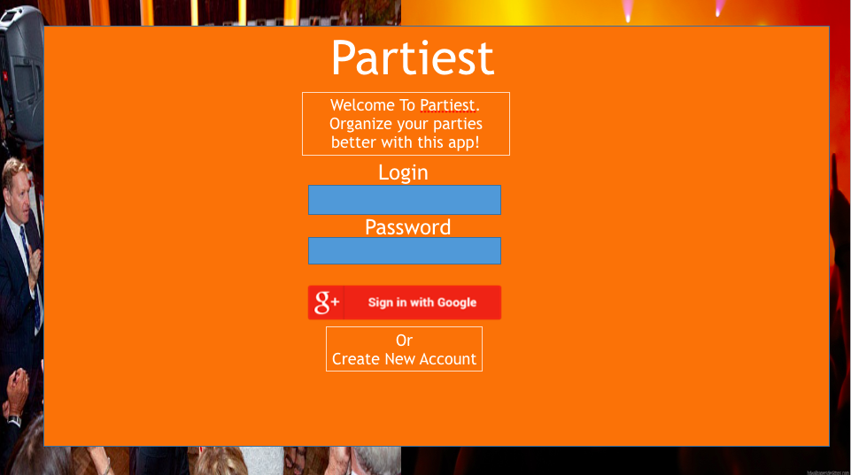
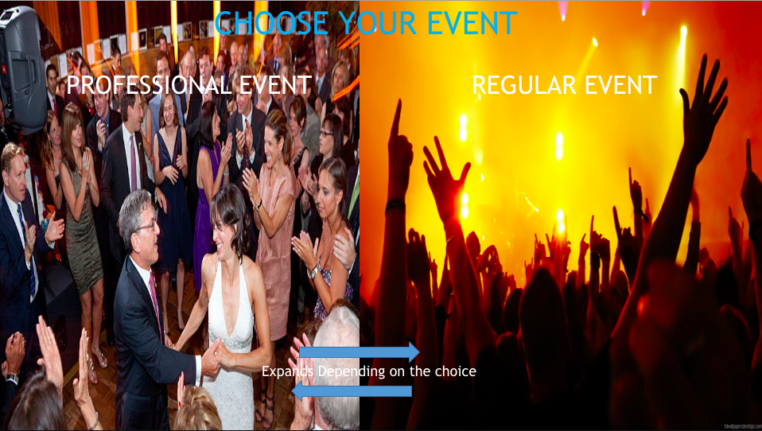
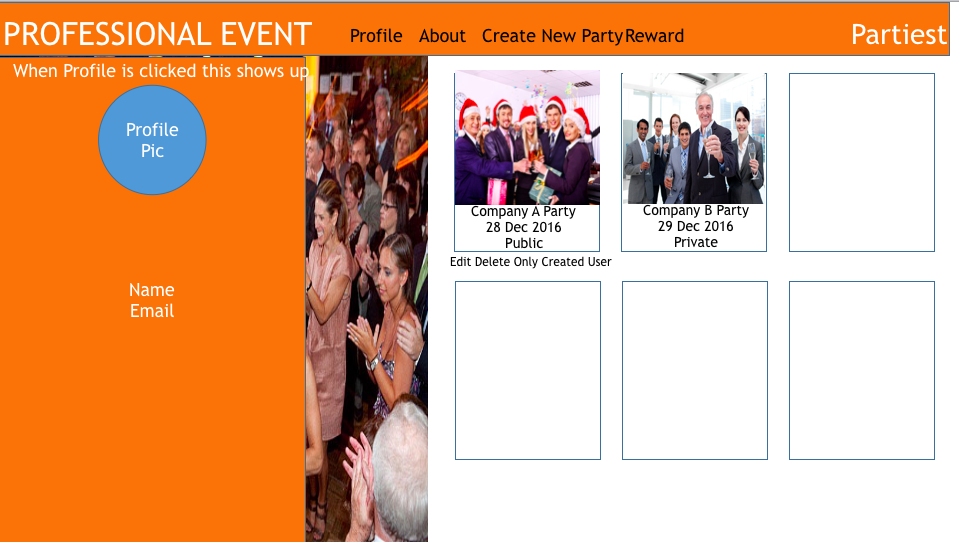
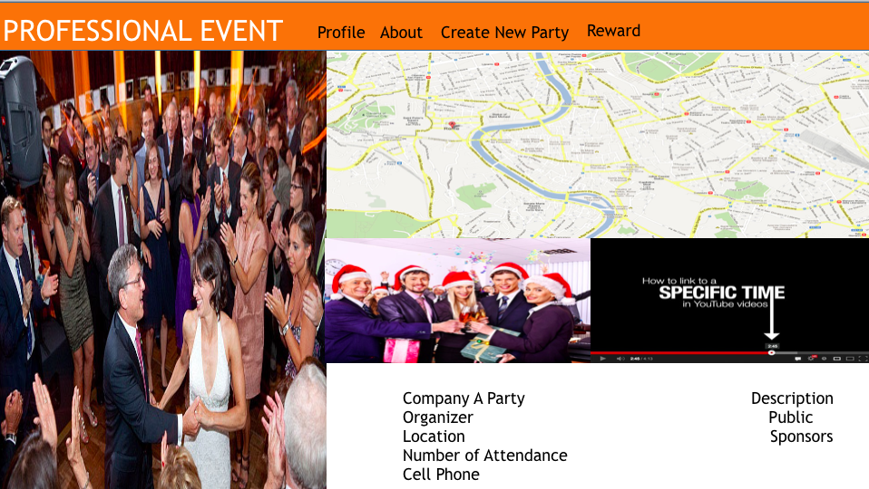
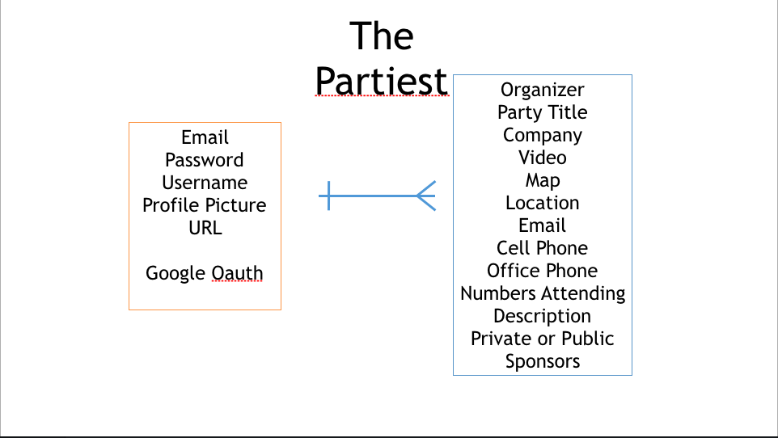

# Project 4 - The Partiest

By Paul Baik

###Description
Tired of organizing office party through powerpoint?  Use The Partiest.  A MEAN Stack application that let's you use google maps with video advertisement from youtube.com.  You can make your office party grow your business by adding sponsors to your invites.  The more you organize office party through The Partiest, the more reward points you earn to get more free stuff!

### Approach Taken
First comes the planning phase where I would write the overall model along with wireframes and ERDs.  Once the project has been initiated, I started setting up all of back end using MEN (Mongo, Express, Node).  I would test if back end works by using Postman and initiate Front-End using Angular.

### Links to the Sites
* [Github IO](https://neonagx.github.io/partiestfrontend/)
* [Heroku Backend](https://partiest.herokuapp.com/)
* [partiestbackend](https://github.com/neonagx/partiestbackend)

### Trello Board
[Trello Board Link](https://trello.com/b/nRVBlr3O/the-partiest)

### ERD and wireframes

### Technologies Used
* Angular Material - A built-in angular styling for overall site design.
* MongoDB - Used to store database for back-end and front end.
* Express - A modern framework that is used to build MVC structure.
* Angular - A google framework that organize and structure this application.
* NodeJS - A tool to run Javascript on the server end.
* ng-Map - A Google Map API that allows users to use google maps on Angular JS.
* JWTs - Allows user to store local token and authenticate their token to access the content of this application.
* Postman - A program that allows testing of CRUD on the back-end.

### Installation Instructions
- Back-End
* Create a respository on your local storage.
* Git Clone partiestbackend to the respository and cd into it.
* Initiate npm install to install node modules.
* If you have Mongo, type mongod to initiate MongoDB.
* On another tab of your console, start nodemon to start the server and complete back end initiation.

- Front-End
* Create another respository.
* Git clone paritestfrontend.
* While running backend on another tab, type server to initiate http server.  
* Run Front-End

### Unsolved Problems
While initiating show html, there is failed to execute 'querySelector'.  It does not disrupt showing google maps, but cannot figure out exactly what causing the problem.

### Stretch Goal
While professional parties are complete, I would like to add regular parties feature to this site.  This allows wider audience, not just for corporate business, but also for regular retail business.  Down the road, I will make into a application available for Google Playstore and Macstore using Ionic (converts Javascript files into JAVA)

###MVP
* Able to login using JWT authentication
* Able to create, read, update, destroy party event
* Able to use google maps as third party API
